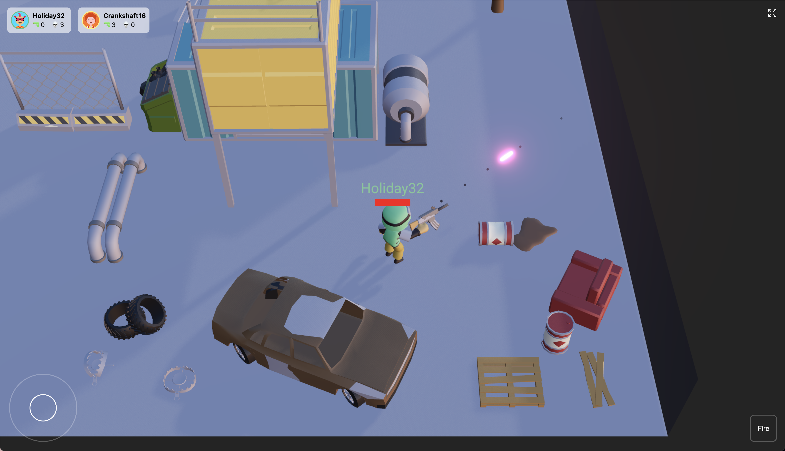
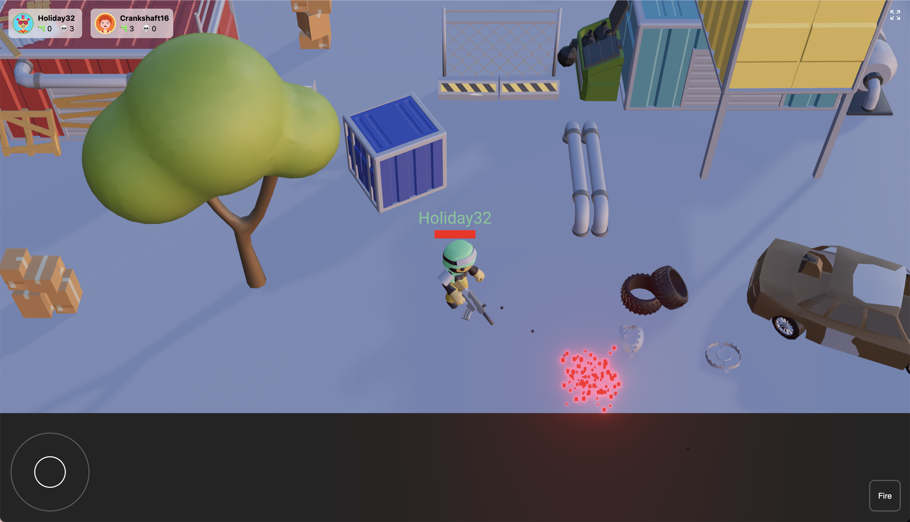
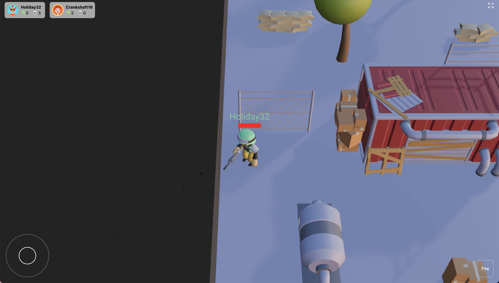

# 3D Shooter Game

A multiplayer 3D shooter game built with React Three Fiber, Rapier Physics, and PlayroomKit. This project combines modern web technologies to create an immersive multiplayer first-person shooter experience that runs in the browser.

## 🎮 Features

- Real-time multiplayer gameplay with PlayroomKit
- First-person shooter mechanics
- Character movement with joystick controls
- Customizable character colors
- Physics-based movement and collisions using Rapier
- Dynamic camera controls
- Weapon system with fire rate control
- Death and respawn mechanics
- Mobile-friendly controls
- Network synchronization of player positions and states

## 🚀 Quick Start

1. Clone the repository:
```bash
git clone https://github.com/PakmanGames/saree-dee-shoota.git
cd 3d-shooter
```

2. Install dependencies:
```bash
yarn
```

3. Start the development server:
```bash
yarn dev
```

4. For mobile testing, run with host flag:
```bash
yarn dev --host
```
_Note: Mobile devices must be connected to the same network as the development machine_

5. Open your browser and navigate to:
- Local: `http://localhost:5173`
- Network: `http://[your-ip]:5173` (for mobile testing)

## 🛠️ Tech Stack

### Core Technologies
- [React Three Fiber](https://github.com/pmndrs/react-three-fiber) - React renderer for Three.js
- [@react-three/rapier](https://github.com/pmndrs/react-three-rapier) - Physics engine
- [@react-three/drei](https://github.com/pmndrs/drei) - Useful helpers for React Three Fiber
- [PlayroomKit](https://playroomkit.dev/) - Multiplayer functionality
- [Three.js](https://threejs.org/) - 3D graphics library
- [Vite](https://vitejs.dev/) - Build tool and dev server

### Additional Dependencies
- [@react-three/postprocessing](https://github.com/pmndrs/react-postprocessing) - Post-processing effects
- [leva](https://github.com/pmndrs/leva) - Debug UI
- [three-stdlib](https://github.com/pmndrs/three-stdlib) - Three.js utilities
- [TailwindCSS](https://tailwindcss.com/) - Styling

## 🎮 Game Controls

### Desktop
- **Movement**: WASD or Arrow keys
- **Shooting**: Left mouse button
- **Camera**: Mouse movement

### Mobile
- **Movement**: On-screen joystick
- **Shooting**: Shoot button on joystick
- **Camera**: Automatic following

## 📁 Project Structure

```
src/
├── assets/           # Game assets (models, textures, etc.)
├── components/       # React components
│   ├── CharacterController.jsx  # Player movement and controls
│   ├── CharacterSoldier.jsx     # Character model and animations
│   ├── Experience.jsx          # Main game scene
│   └── Map.jsx                 # Game map and environment
├── App.jsx          # Root component
├── main.jsx         # Entry point
└── index.css        # Global styles
```

## 🎯 Game Mechanics

### Physics and Movement
- Characters use `RigidBody` with `CapsuleCollider` for collision detection
- Movement is physics-based with impulse forces
- Characters have locked rotations to prevent tipping
- Network synchronization of player positions

### Multiplayer Features
- Real-time player synchronization
- Player state management (health, deaths, kills)
- Host/client architecture for physics calculations
- Player join/quit handling
- Room-based multiplayer system

## 🛠️ Development

### Building for Production
```bash
yarn build
yarn preview
```

### Development Features
- Hot Module Replacement (HMR)
- TypeScript support
- Optimized production builds
- Development server with automatic reloading
- Debug UI with Leva

## 📸 Screenshots





